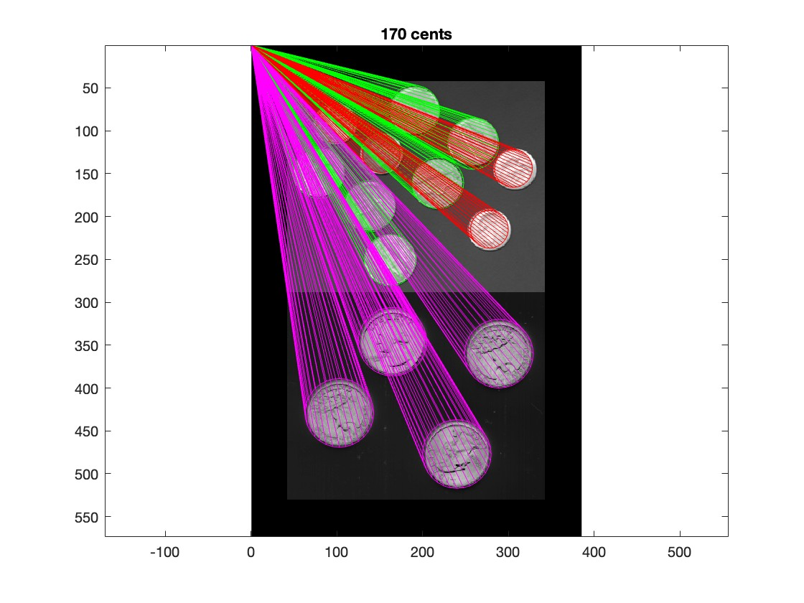

# Detailed Image Processing Results

## 1. Test Image Construction

**Composite grayscale image used for coin detection - **
This image combines two built-in MATLAB images: coins.png (bright coins on dark background) and the inverted eight.tif (dark coins on bright background). 
Zero-padding ensures the filter can process edge pixels.

## 2. Otsu Thresholding

**Binary mask created using Otsu’s method -**
Otsu’s thresholding automatically separates foreground (coins) from the background by maximizing inter-class variance. 
This binary mask is the initial step in identifying coin shapes.

## 3. Dilated Mask

**Dilated binary mask to close small holes and connect regions - **
A 9x9 dilation kernel was applied to enhance coin shapes, bridging gaps within and around coin edges, preparing them for accurate detection.

## 4. Eroded Mask

**Refined mask after erosion to isolate coins - **
A 23x23 erosion reduces noise and separates connected coins after dilation. The result highlights individual coins as distinct blobs.

## 5. Matching Filters

**Circular filters for dimes, nickels, and quarters -**
These are template matching filters designed to correlate with coins based on their approximate diameters. They serve as feature extractors for classification.
Showing dime, nickel, and quarter filters used for matching. Kept for completeness in processing steps.

## 6. Final Classification

**Detected and classified coins -**
Coins are detected, classified via k-means clustering, and visualized with colored outlines. 
Each color represents a different coin type, and the total value of coins is displayed at the top.

